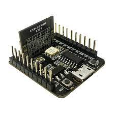

# 'Traffic Light' RGB LED Example

## Board

Board: ESP-C3-01M module



## Environment

Enable ESP-IDF paths:

```bash
$ . /path/to/esp/esp-idf/export.sh
```

Select target:

```bash
$ idf.py set-target esp32c3
```

If needed, tune ESP-IDF build configuration using menuconfig:

```bash
$ idf.py menuconfig
```

Build sample project:

```bash
$ idf.py build
```

Flash images to the board:

```bash
$ idf.py -p /dev/ttyUSB0 flash
```

Restart and monitor serial logs:

```bash
$ idf.py monitor
```
